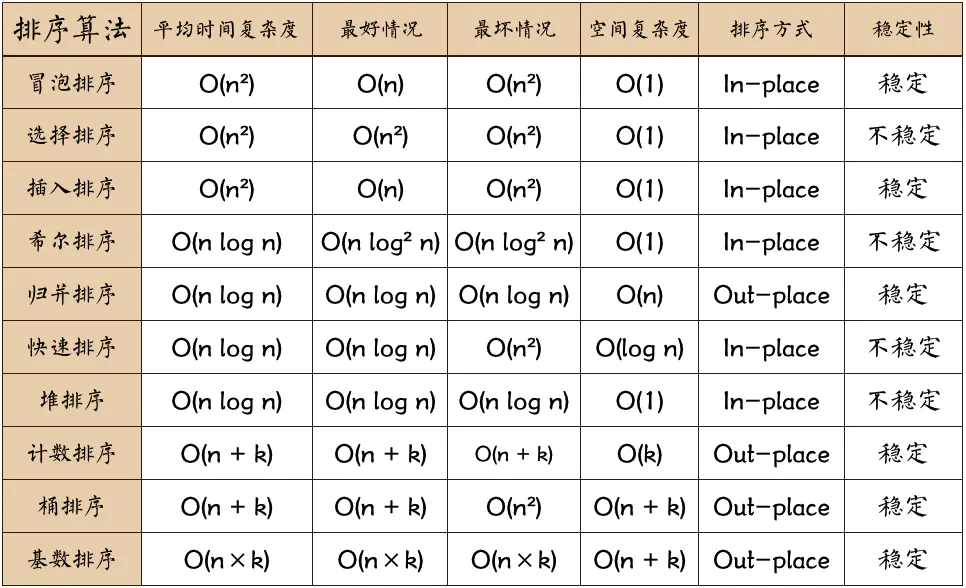

# InterviewQuestions
前端面试题Demo汇总

## HTML
1. 浏览器渲染原理
   1. 首先解析收到的文档，根据文档定义构建一颗 DOM 树，DOM 树是由 DOM 元素及属性节点组成的；
   2. 然后对 CSS 进行解析，生成 CSSOM 规则树；
   3. 根据 DOM 树和 CSSOM 规则树构建 Render Tree。渲染树的节点被称为渲染对象，渲染对象是一个包含有颜色和大小等属性的矩形，渲染对象和 DOM 对象相对应，但这种对应关系不是一对一的，不可见的 DOM 元素不会被插入渲染树。
   4. 当渲染对象被创建并添加到树中，它们并没有位置和大小，所以当浏览器生成渲染树以后，就会根据渲染树来进行布局（也可以叫做回流）。这一阶段浏览器要做的事情就是要弄清楚各个节点在页面中的确切位置和大小。通常这一行为也被称为“自动重排”。
   5. 布局阶段结束后是绘制阶段，比那里渲染树并调用对象的 paint 方法将它们的内容显示在屏幕上，绘制使用 UI 基础组件。
   6. 为了更好的用户体验，渲染引擎会尽可能早的将内容呈现到屏幕上，并不会等到所有的 html 解析完成之后再去构建和布局 render tree。它是解析完一部分内容就显示一部分内容，同时可能还在网络下载其余内容。
2. 简述前端性能优化
   1. 页面内容方面
      1. 通过文件合并、css 雪碧图、使用 base64 等方式来减少 HTTP 请求数，避免过多的请求造成等待的情况；
      2. 通过 DNS 缓存等机制来减少 DNS 的查询次数；
      3. 通过设置缓存策略，对常用不变的资源进行缓存；
      4. 通过延迟加载的方式，来减少页面首屏加载时需要请求的资源，延迟加载的资源当用户需要访问时，再去请求加载；
      5. 通过用户行为，对某些资源使用预加载的方式，来提高用户需要访问资源时的响应速度； 
   2. 服务器方面
      1. 使用 CDN 服务，来提高用户对于资源请求时的响应速度；
      2. 服务器端自用 Gzip、Deflate 等方式对于传输的资源进行压缩，减少传输文件的体积；
      3. 尽可能减小 cookie 的大小，并且通过将静态资源分配到其他域名下，来避免对静态资源请求时携带不必要的 cookie；

## CSS
1. 标准盒模型和怪异盒模型
   w3c标准盒模型: box-sizing: content-box盒子高度仅由content 宽高决定，不包含padding/border/margin
   IE盒魔性: box-sizing: border-box盒子高度包含 padding/border (常用)
2. [浏览器重绘和回流](./md/浏览器重绘回流.md)

## JS
1. [从浏览器地址栏输入 url 到显示页面的步骤](./md/从浏览器地址栏输入%20url%20到显示页面的步骤.md)
2. [Promise 相关](./code/Promise.js)
3. [发布订阅 Event Emitter](./code/EventEmitter.js)
4. [JS实现继承](./md/JS实现继承.md)
5. [String 相关](./code/String)
   1. [给定一个模板和一个对象，利用对象中的数据渲染模板，并返回最终结果。](./code/String/renderTemplate.js)
6. [项目优化方案](./md/项目优化.md)
7. [排序相关](./code/Sort)
   1. [冒泡排序](./code/Sort/bubbleSort.js)
   2. [选择排序](./code/Sort/selectionSort.js)
   3. [插入排序](./code/Sort/insertionSort.js)
   4. [快速排序](./code/Sort/quickSort.js)
8. 隐式类型转换 == 的5条规则[例题](./md/==.md)
   1. NaN和其他任何类型比较永远返回false（包括和他自己）
   2. Boolean 和其他任何类型比较，Boolean 首先被转换为 Number 类型。
   3. String和Number比较，先将String转换为Number类型。
   4. null == undefined比较结果是true，除此之外，null、undefined和其他任何结果的比较值都为false。
   5. 原始类型和引用类型做比较时，引用类型会依照ToPrimitive规则转换为原始类型。
9. [webpack优化](./md/webpack做过哪些优化.md)
10. [Event Loop Node和浏览器差异](./md/EventLoop.md)
11. ES5/ES6 的继承除了写法以外还有什么区别？
    1.  class 声明会提升，但不会初始化赋值。（类似于 let、const 声明变量；
    2.  class 声明内部会启用严格模式；
    3.  class 的所有方法（包括静态方法和实例方法）都是不可枚举的；
    4.  class 的所有方法（包括静态方法和实例方法）都没有原型对象 prototype，所以也没有 [[constructor]]，不能使用 new 来调用；
    5.  必须使用 new 来调用 class；
    6.  class 内部无法重写类名；
12. [Async/Await 的原理](./code/AsyncAwait.js)
13. 箭头函数与普通函数（function）的区别是什么？构造函数（function）可以使用 new 生成实例，那么箭头函数可以吗？为什么？
    1.  函数体内的 this 对象，就是定义时所在的对象，而不是使用时所在的对象；
    2.  不可以使用 arguments 对象，该对象在函数体内不存在。如果要用，可以用 rest 参数代替；
    3.  不可以使用 yield 命令，因此箭头函数不能用作 Generator 函数；
    4.  不可以使用 new 命令，因为：没有自己的 this，无法调用 call、apply；没有 prototype 属性，而 new 命令在执行时需要将钩子函数的 prototype 赋值给新的对象的 __proto__
14. [MVC、MVP、MVVM](./md/MVC/MVP/MVVM.md)
15. js中常见的几种内存泄露
    1.  意外的全局变量；
    2.  闭包；
    3.  未被清空的定时器；
    4.  未被销毁的事件监听；
    5.  DOM 引用；
16. React
    1.  [Fiber](./md/Fiber.md)
17. Vue
    1.  vue name 作用
        1.  keep-alive 使用 name 做缓存过滤
        2.  递归组件用 name 调用自身
        3.  vue-devtools 展示名字
    2.  [Vue 为什么要用 vm.$set() 解决对象新增属性不能响应的问题 ？你能说说如下代码的实现原理么？](./md/Vue.$set.md)
    3.  Vue 的响应式原理中 Object.defineProperty 有什么缺陷？为什么在 Vue3.0 采用了 Proxy，抛弃了 Object.defineProperty？
        1.  Object.defineProperty 无法低耗费的监听到数组下标的变化，导致通过数组下标添加元素，不能实时响应；
        2.  Object.defineProperty 只能劫持对象的属性，从而需要对每个对象，每个属性进行遍历。如果属性值是对象，还需要深度遍历。 Proxy 可以劫持整个对象， 并返回一个新的对象。
        3.  Proxy 不仅可以代理对象，还可以代理数组。还可以代理动态增加的属性。